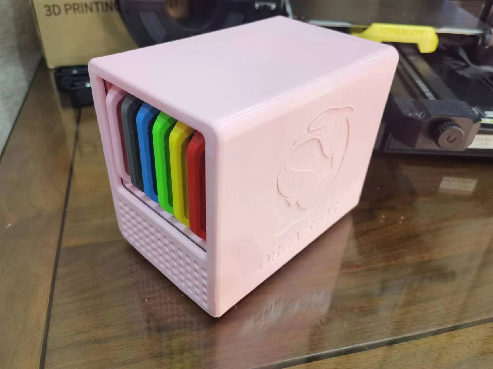
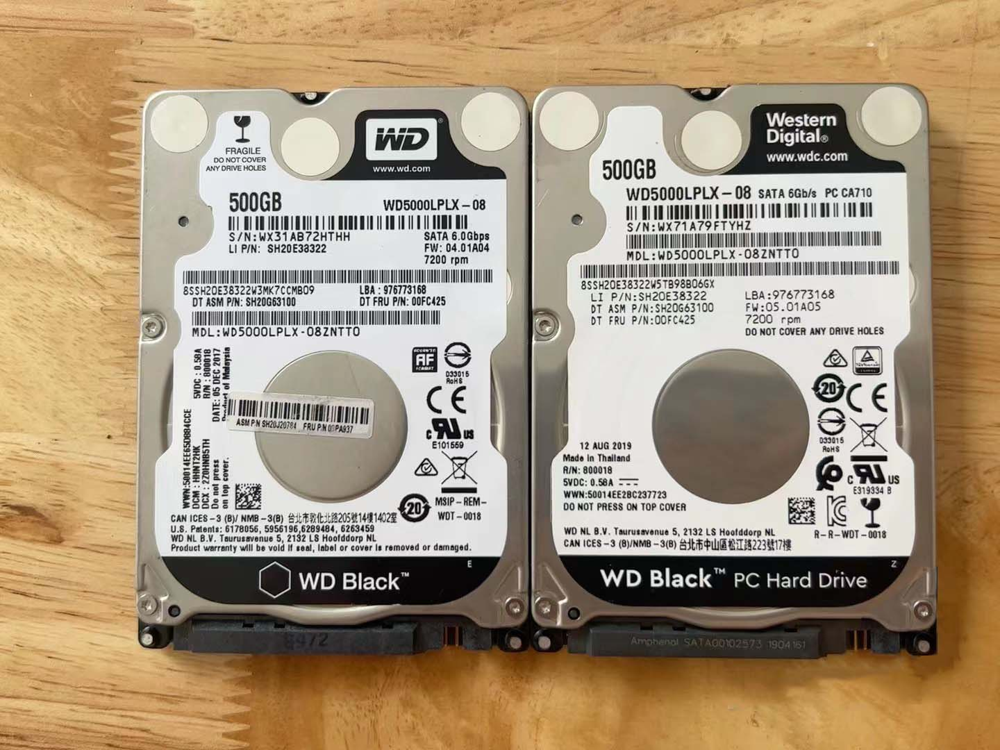
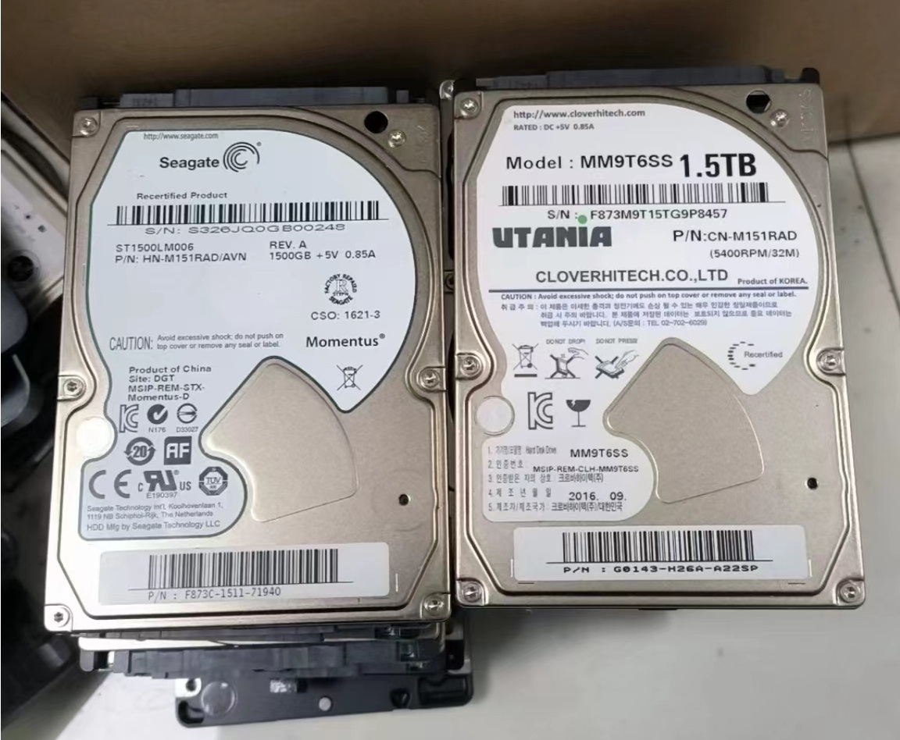
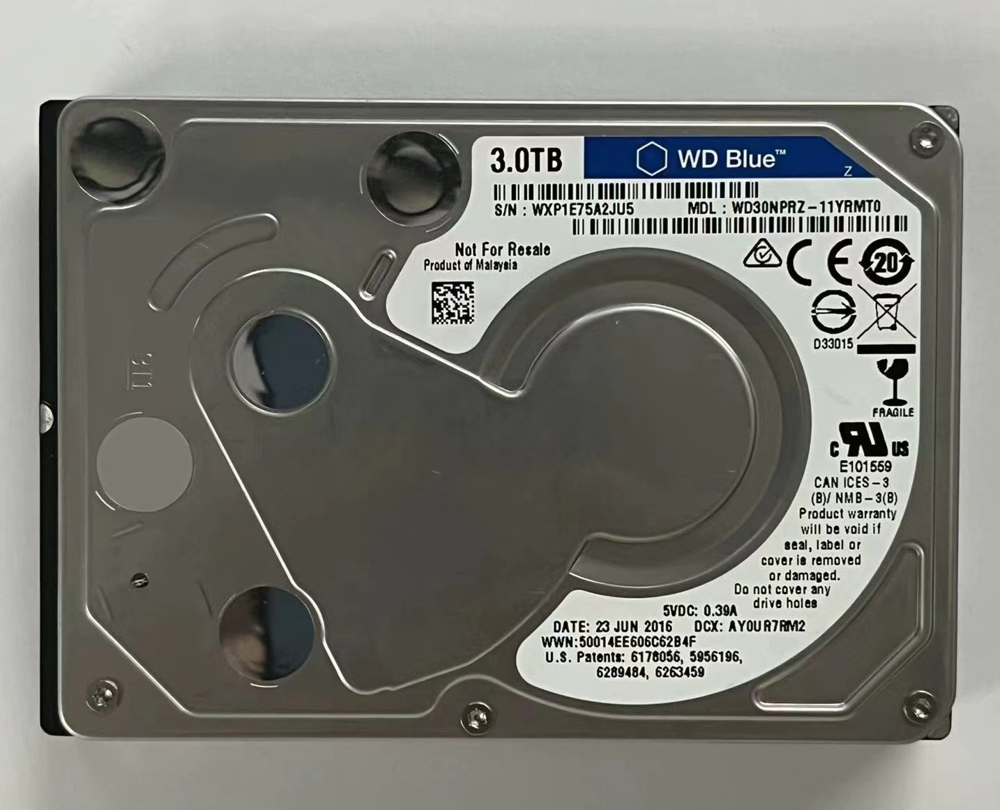
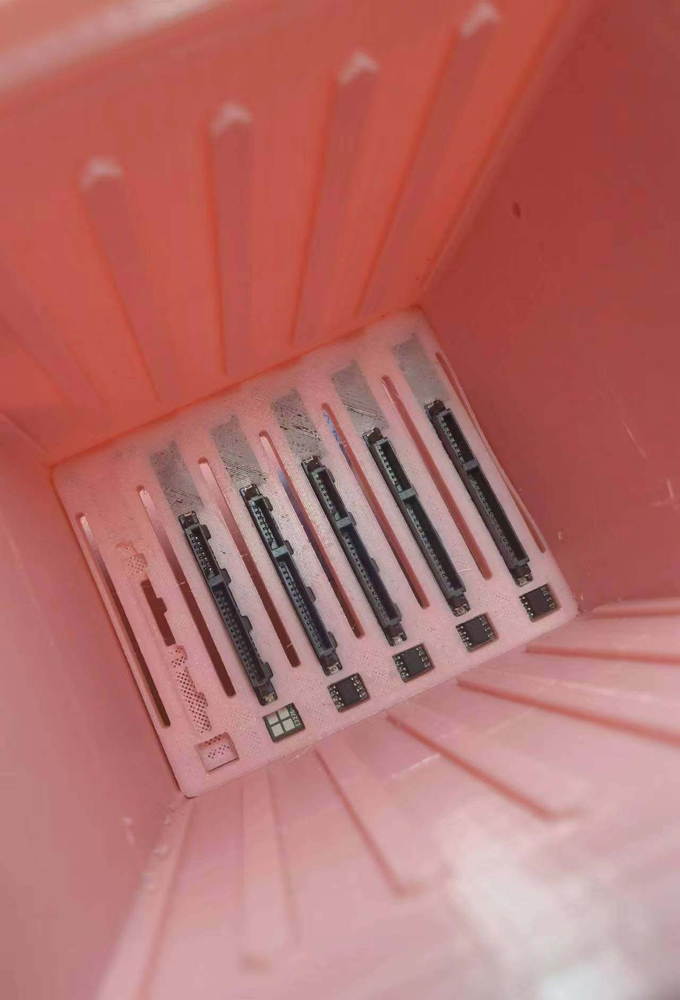
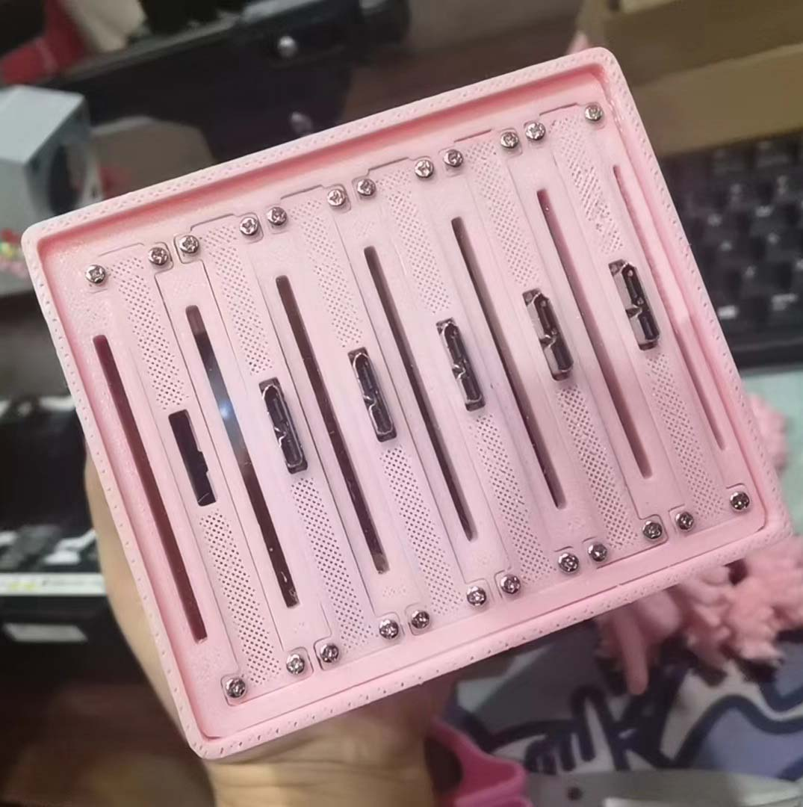
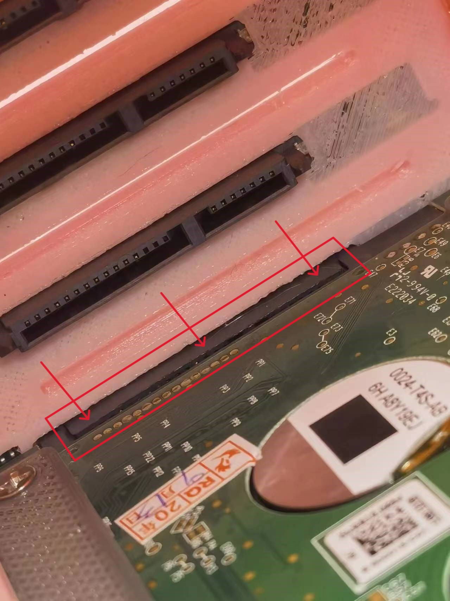

  

<h1 align="center"><strong>OrcaS 3D打印外壳</strong></h1>

  

<h1 align="center">BOM表</h1>

## 打印件

- 衍生自[@汪汪队射手](https://space.bilibili.com/300702869)的[QNAS Mini](https://github.com/thunder439/QNASMINI)，非常感谢~

|位置|数量|材质|1.75mm用量|100mm/s耗时|精度|配置||
|-|-|-|-|-|-|-|-|
|外壳|1|PETG/PLA/ABS|244g 103.89m|31h8min|0.2mm|2层墙，2层顶底，20%锯齿填充||
|内框|1|PETG/PLA/ABS|194g 64.92m|26h40min|0.2mm|2层墙，0层顶底，30%锯齿填充||
|硬盘笼|1|PETG/PLA/ABS|151g 50.55m|33h23min|0.2mm|2层墙，0层顶底，40%锯齿填充||
|硬盘支架|6|PETG/ABS|11g 3.54m|1h51min|0.2mm|3层墙，0层顶底，30%锯齿填充||
|背板|1|PETG/ABS|22g 7.30m|5h12min|0.12mm/0.16mm|2层墙，1层顶底，60%锯齿填充|注意凹槽向下|
|背盖|6|PETG/ABS|1g 0.39m|17min|0.12mm/0.16mm|2层墙，0层顶底，50%锯齿填充||

- 材料费：按1kg 50元计算，683g=￥34
- 电费：按市电0.7每度算，350W的打印机耗电38.5度=￥27
- 打印成本：￥61

## 采购件

|类目|数量|价格|配置|
|-|-|-|-|
|Orange Pi 5（4G）主板|1|￥499|
|32GB闪迪10速TF卡|1|￥25|
|5V4A Type-C电源|1|￥20|
|Type-C -> USB3.0×7 Hub|1|￥15|
|40×20×3mm硅胶脚垫|4|￥10|发6个|
|希捷硬盘盒裸板易驱线（送数据线）|6|￥60|主控JMS577泰国产|
|Type-C公头带软排线|1|￥7|
|Type-C两焊点母座|1|￥2.5|
|4010风扇|2|￥7|
|JST-2P 母头|1|￥2.5|发5根|
|热缩管|3|￥3|发164根|
|20×35mm过线防尘橡胶圈|1|￥2|发4个|
|M3×4+3六角螺丝铜柱|4|￥1.8|发15颗|
|M3带螺母14mm（风扇）|8|￥3|发20套|
|M1.7×6自攻螺丝（背盖）|24|￥4|发200颗|
|M3×4.8（硬盘）|24|￥5|发100颗|
|M3×7沉头内六角（内框）|4|￥2|发5颗|
|总计||￥618.8||

## 工具

- 3D打印机
- 十字起子
- 修边雕刻刀
- 电烙铁
- 小号内六角扳手

## 建议配置

- 【×6】2.5英寸机械硬盘，附：[垂直盘、叠瓦盘型号大全](https://www.chiphell.com/thread-2352857-1-1.html?ivk_sa=1024320u)
  - 西数黑盘WD5000LPLX【500 GB】7200转 7 mm（性能好的2.5英寸垂直盘）（闲鱼价格在￥65左右）
  
    

  - 三星希捷ST1500LM006【1.5 TB】5400转 9.5 mm（上面表里面没有列）（闲鱼价格在￥188左右）

    

  - 西数蓝盘WD30NPRZ【3 TB】5400转 13.5 mm（容量最大的2.5英寸垂直盘，上面表里面没有列）（闲鱼价格在￥380左右）

    

  - 小文件多可以选择500 GB × 6，视频、电影多可以选择3TB × 6，或混合存储500 GB × 4 + 3 TB × 2
- 【×1】120 GB SSD装在主板下方的内框上（闲鱼价格￥50左右，要求不高）
- 【×1】128 GB NVMe SSD装在M.2接口上（三星PM991或者西数SN520，闲鱼价格￥40左右）
- 【选配】【×1】外挂1\~5TB移动硬盘到USB 3.0接口（480 MB/s）（￥500左右，建议西数移动硬盘Elements）
- 总容量：3\~18 TB内存储 + 128 GB SSD系统盘 + 120 GB SSD加速盘 + 1\~5T外存储
- 存储总价：￥480~2370

> ⚠ 注意：最右侧硬盘高度只支持到10 mm，如果满配6块3 TB，可以将主板下方的内框上SSD加速盘和最右侧硬盘对调

## 总成本

 打印件成本￥61 + 采购件成本￥618.8 + 存储成本￥480\~2370 = ￥1159.8~3049.8

<h1 align="center">独特的改进</h1>

- 自制背板（成本低至21.9%）
- 可进可出穿线孔（MIC、HDMI、移动硬盘等）

<h2 align="center">自制背板成本低至21.9%</h2>

### 原方案：

|类目|数量|价格|
|-|-|-|
|6盘位背板|1|￥150|
|M.2转6口SATA|1|￥115|
|SATA线|6|￥78|
|总计||￥343|

### 新方案：

|类目|数量|价格|
|-|-|-|
|希捷硬盘盒裸板易驱线（送数据线）|6|￥60|
|Type-C -> USB3.0×7 Hub|1|￥15|
|总计||￥75|

### 效果（严丝合缝）

### 优势：

- 只有USB 3.1 Type-C接口的情况下（比如Orange Pi 5主板）
- PCIe 2.0 ×1的接口（480 MB/s）没有USB 3.1 Type-C（1250 MB/s）的速度快，该方案更合适

<h2 align="center">为什么选择RK3588而不是J4125？</h2>

- 性能对比 [J4125 vs RK3588S](https://gadgetversus.com/processor/intel-celeron-j4125-vs-rockchip-rk3588s/)

||Intel Celeron J4125|Rockchip RK3588S|
|-|-|-|
|架构|✔️x86应用支持广泛|ARM支持少|
|PCIe通道|✔️×4|×1|
|CPU评分|3,031|✔️6,133|
|AI算力|-|✔️6T ops|
|内存上限|8GB|✔️32GB|
|核心数|4核|✔️8核|
|GPU评分|45.4 GFLOPS|✔️65.3 GFLOPS|
