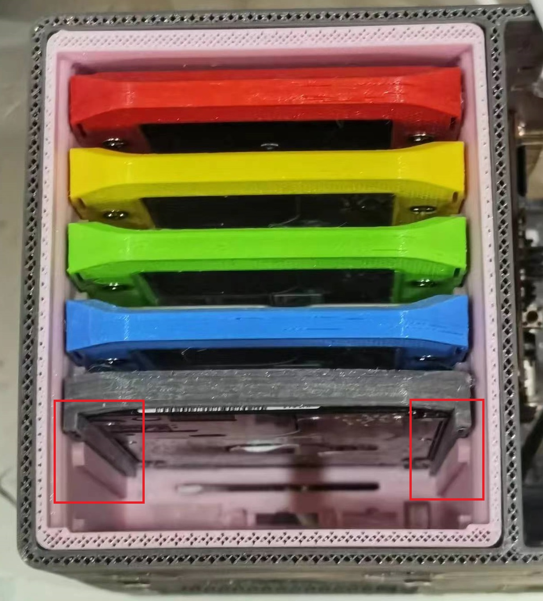
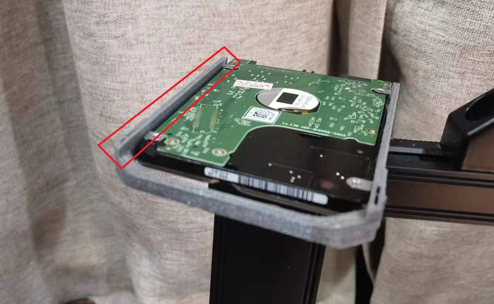

  

<h1 align="center"><strong>OrcaS 3D打印外壳</strong></h1>

  

<h1 align="center">BOM表</h1>

## 打印件

- 衍生自[@汪汪队射手](https://space.bilibili.com/300702869)的[QNAS Mini](https://github.com/thunder439/QNASMINI)，非常感谢~

|位置|数量|材质|1.75mm用量|100mm/s耗时|配置|修改|
|-|-|-|-|-|-|-|
|外壳|1|PETG/PLA/ABS|244g 103.89m|31h8min|0.2mm精度，2层墙，2层顶底，20%锯齿填充|🆙增加LOGO|
|内框|1|PETG/PLA/ABS|197g 66.07m|27h21min|0.2mm精度，2层墙，2层顶底，30%锯齿填充|🆙大幅修改：改风扇孔，改主板插孔，改电源孔，改SSD固定方式|
|硬盘笼|1|PETG/PLA/ABS|151g 50.55m|33h23min|0.2mm精度，2层墙，0层顶底，40%锯齿填充|🆙去除后背，背板为卡入式|
|硬盘支架|6|PETG/ABS|11g 3.54m|1h51min|0.2mm精度，3层墙，0层顶底，30%锯齿填充|-|
|【可选】15mm厚度硬盘支架|6|PETG/ABS|7g 2.33m|1h5min|0.2mm精度，3层墙，0层顶底，30%锯齿填充|🆕新增 ⚠注意反过来打印|
|背板|1|PETG/ABS|22g 7.30m|5h12min|0.12mm/0.16mm精度，2层墙，1层顶底，60%锯齿填充|🆕新增 ⚠注意凹槽向下|
|背盖|6|PETG/ABS|1g 0.39m|17min|0.12mm/0.16mm精度，2层墙，0层顶底，50%锯齿填充|🆕新增|

- 材料费：按1kg 50元计算，728g=￥36.4
- 电费：按市电0.7每度算，350W的打印机耗电40.6度=￥28.4
- 打印成本：￥64.8

## 采购件

|类目|数量|价格|配置|
|-|-|-|-|
|Orange Pi 5（4G）主板|1|￥499|
|32GB闪迪10速TF卡|1|￥25|
|5V6A 55×25 DC电源|1|￥12|30W|
|ORICO Type-C -> USB3.0×7 Hub（带供电）|1|￥36.7|5Gbps|
|40×20×3mm硅胶脚垫|4|￥10|发6个|
|希捷硬盘盒裸板易驱线（送数据线）|6|￥50|主控JMicron JMS577 / ASMedia ASM1153，适配了四款，[点这里查看型号样式](#%E6%94%AF%E6%8C%81%E7%9A%84%E5%9B%9B%E7%A7%8D%E5%9E%8B%E5%8F%B7%E7%9A%84%E8%A3%B8%E6%9D%BF)|
|Type-C公头带软排线|2|￥14|
|55×25 DC母座|1|￥2.5|**11mm开孔** 纯金属款，中间正极短，外围负极长，不易接错|
|4010风扇|2|￥7|主板26pin右边第2-3pin|
|JST-2P 母头|1|￥2.5|发5根|
|热缩管|3|￥3|发164根|
|20×35mm过线防尘橡胶圈|1|￥2|发4个|
|M3×5+3或M3×6+3六角螺丝铜柱|4|￥1.8|发15颗|
|M3带螺母14mm螺丝（风扇）|8|￥3|发20套|
|M1.7×6自攻螺丝（背盖）|24|￥4|发200颗|
|M3×4.8沉头十字螺丝（硬盘）|24|￥5|发100颗|
|M3×8沉头十字螺丝（底框硬盘）|5|￥1.3|发50颗|
|M3×7沉头内六角螺丝（内框）|4|￥2|发5颗|
|总计||￥680.8||

## 工具

- 3D打印机
- 十字起子
- 修边雕刻刀
- 电烙铁
- 小号内六角扳手

## 建议配置

- 【×6】2.5英寸机械硬盘，附：[垂直盘、叠瓦盘型号大全](https://www.chiphell.com/thread-2352857-1-1.html?ivk_sa=1024320u)
  - 西数黑盘WD5000LPLX【500 GB】7200转 7 mm（性能超好又足够大的垂直盘，实测 **150 MB/s**）（闲鱼价格在￥65左右）

    

  - 三星希捷ST1500LM006【1.5 TB】5400转 9.5 mm（垂直盘，上面表里面没有列）（闲鱼价格在￥188左右）

    

  - 西数蓝盘WD30NPRZ【3 TB】5400转 13.5 mm（容量最大的2.5英寸垂直盘，上面表里面没有列，实测 **100+ MB/s**）（闲鱼价格在￥380左右）
    - **（需打印15mm厚度硬盘支架）**

    

  - 小文件多可以选择500 GB × 6，视频、电影多可以选择3 TB × 6，或混合存储500 GB × 4 + 3 TB × 2等等
- 【×1】120 GB SSD装在主板下方的内框上（闲鱼价格￥50左右，要求不高）
- 【×1】128 GB 2242 NVMe SSD装在M.2接口上（三星PM991或者西数SN520，闲鱼价格￥40左右）
- 【选配】【×1】外挂1 \~ 5TB移动硬盘到USB 3.0接口（480 MB/s）（￥500左右，建议西数移动硬盘Elements）
- 总容量：3 \~ 18 TB内存储 + 128 GB SSD系统盘 + 120 GB SSD加速盘 + 1 \~ 5T外存储
- 存储总价：￥480 \~ 2370

> ⚠ **注意：最右侧硬盘厚度只支持到10 mm，如果满配6块3 TB，可以将主板下方的内框上SSD加速盘和最右侧硬盘对调**

## 总成本

 打印件成本￥64.8 + 采购件成本￥680.8 + 存储成本￥480 \~ 2370 = ￥1225.6 \~ 3115.6

<h1 align="center">独特的改进</h1>

- 自制热插拔背板（成本低至25%）
- 硬盘最大厚度支持到15mm（除最右侧一块）
- 可进可出穿线孔（耳机、HDMI、内置硬盘外插USB3.0口、移动硬盘内插hub等）
- 主板下方内框上硬盘修改更牢靠固定方式，改为靠边且5螺丝固定
- 用两个4010风扇使用板载5V供电代替原来12V供电的8010风扇

<h2 align="center">自制热插拔背板成本低至25%</h2>

### 原方案：

|类目|数量|价格|
|-|-|-|
|6盘位背板|1|￥150|
|M.2转6口SATA|1|￥115|
|SATA线|6|￥78|
|总计||￥343|

### 新方案：

|类目|数量|价格|
|-|-|-|
|希捷硬盘盒裸板易驱线（送数据线）|6|￥50|
|Type-C -> USB3.0×7 Hub（带供电）|1|￥36.72|
|总计||￥86.72|

> ⚠ **注意：实测只加1块硬盘可以使用无供电hub，主板输入5V3A即可，部分hub不加供电能支持到2块硬盘（飞利浦不支持，深圳同创、奥睿科支持，可能和hub本身耗电有关）**

### 效果（严丝合缝）

  

### 支持的四种型号的裸板

  

### 优势：

- 只有USB 3.1 Type-C接口的情况下（比如Orange Pi 5主板）
  - Orange Pi 5主板总共支持12.48Gbps：
    - USB 3.1 Type C接口5Gbps（共享后背白色USB 2.0接口）
    - USB 3.0接口5Gbps
    - PCIe 2.0 ×1接口2Gbps
    - USB 2.0接口0.48Gbps
- PCIe 2.0 ×1的接口（2Gbps|250 MB/s）没有USB 3.1 Type-C（5Gbps|625 MB/s）的速度快，该方案更合适
- 单个7口USB 3.0 hub（5Gbps|625 MB/s）
  - 6块盘如果全配3 TB蓝盘（100MB/s每块）（3.0 hub满速）
  - 如果配置有黑盘（能到150MB/s每块），最多
    - 2块黑盘+2块3 TB蓝盘（3.0 hub满速） + 1块SSD接后背USB 3.0口
    - 4块黑盘（3.0 hub满速） + 1块SSD、1块3 TB蓝盘接后背USB 3.0口

<h2 align="center">硬盘最大厚度支持到15mm</h2>

  

<h2 align="center">主板下方内框上硬盘固定方式</h2>

  

<h2 align="center">为什么选择RK3588S而不是J4125？</h2>

- 性能对比 [J4125 vs RK3588S](https://gadgetversus.com/processor/intel-celeron-j4125-vs-rockchip-rk3588s/)

||Intel Celeron J4125|Rockchip RK3588S|
|-|-|-|
|架构|✔️x86应用支持广泛|ARM支持少|
|PCIe通道|✔️×4|×1|
|CPU评分|3,031|✔️6,133|
|AI算力|-|✔️6T ops|
|内存上限|8GB|✔️32GB|
|核心数|4核|✔️8核|
|GPU评分|45.4 GFLOPS|✔️65.3 GFLOPS|

<h1 align="center">升级功能</h1>

<h2 align="center">风扇速度模式（参考友商）</h2>

- 液压轴承3线款4010风扇×2（￥21.6）
  - 15cm母头杜邦线（50根￥5.94）
- 参考实现：
  - https://github.com/orangepi-xunlong/orangepi-build/blob/5a7ad4954365a55c2a95d28286ed1a537441ce42/external/packages/blobs/rockchip/pwm-fan.sh
  - https://github.com/yanxiangrong/Fan-Control
  - https://blog.csdn.net/qq_37574109/article/details/134755295
- 计划提供四种模式：
  - 全速模式：风扇全速工作，可保持系统冷却，但发出的噪音较大。
  - 低温模式：风扇以较高的速度工作，可让NAS保持较低的温度，但会发出较大的噪音。
  - 静音模式：风扇以较低的速度工作，发出的噪音较少，但NAS的温度可能会升高。
  - 低功率模式：风扇以较低的速度工作，发出的噪音较少，但NAS的温度可能会升高。此外，当NAS冷却后，风扇会停止以节省电量。
- TBC...
